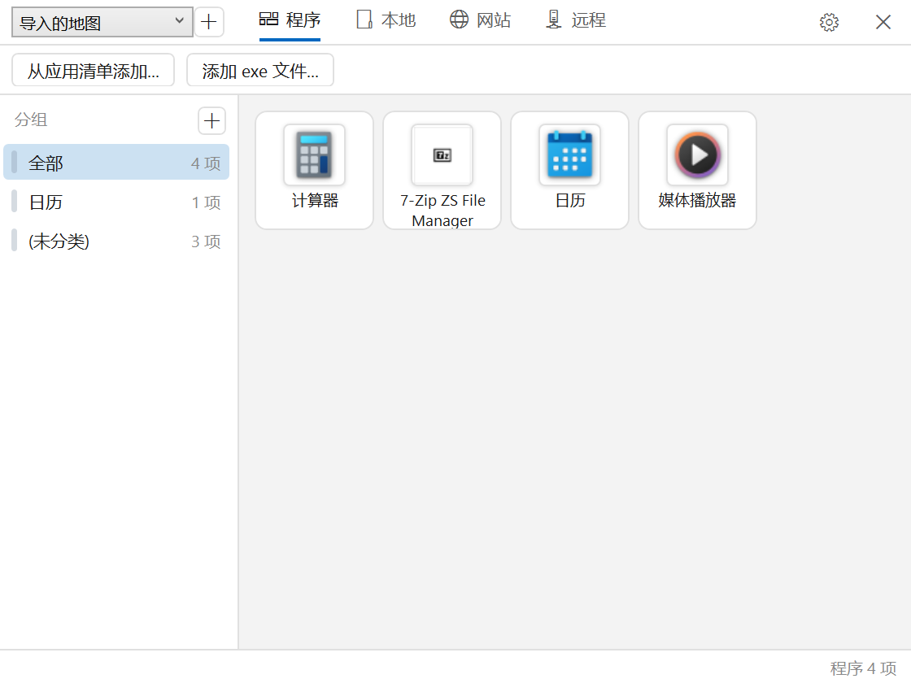
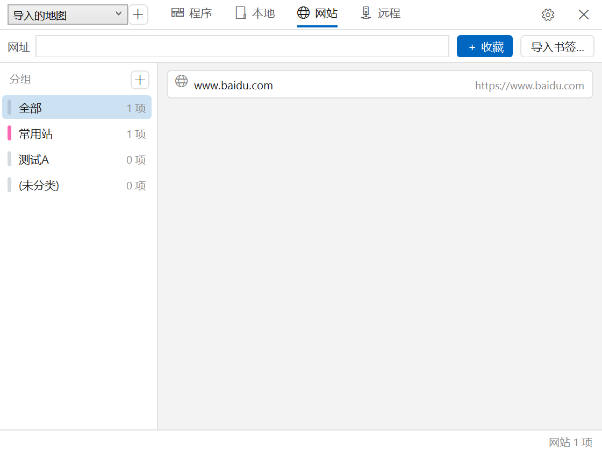

# 任意门 AnywhereDoor

**唤起即跳** —— 给 Windows 的快速启动器：把常用的**程序 / 本地目录 / 网站 / 远程目录**收进一扇门，
四类目标各占一页，每页独立收藏、分组与配色。

> **0.1 Alpha**（2026-10-01）：核心 + GUI + CLI 已可用，自用迭代中 ——
> 数据格式与界面仍可能调整，升级前看 Release 说明。



## 它是什么

- **四页收藏**
  - **程序** —— 手机式方块磁贴：视觉记忆 + 一次点击，不考"记得名字"。
    从开始菜单清单一键挑选，也支持直接加入便携版 exe；UWP 应用取真彩原图标。
  - **本地** —— 目录 / 文件收藏，资源管理器直达。
  - **网站** —— 网址框输入直达 + 收藏；可从 Chrome / Edge / 书签 HTML 导入，书签文件夹自动变成分组。
  - **远程** —— 左侧站点列表复用[易远传（ERF）](#与易远传erf的关系)的站点配置，
    右侧是该站的收藏；上方路径框 + 「直达」一键到远程目录。
- **地图（`.awdmap`）** —— 一整套四页布局（条目 / 分组 / 配色 / 顺序）存成一个紧凑二进制文件。
  随时新建、切换、改名；可导出成 JSON 手改再导入；`maps\` 目录自动扫描，写入原子化（`.bak` 回退）。
- **分组与颜色** —— 左侧栏筛选；分组可改名 / 删除 / 设颜色；条目拖到侧栏即归组，
  筛选态下拖出窗口即脱离分组；程序 / 本地 / 网站三页同一套语义。
- **打开习惯可选** —— 设置里切「单击打开 / 双击打开」。
- **图标管道** —— 开始菜单与 UWP 图标真彩提取、透明边自动裁剪，白底圆角卡片 + 分层阴影，落盘缓存复用。
- **零 NuGet 依赖** —— Shell COM（IShellItem / IShellLinkW / IApplicationActivationManager /
  IShellItemImageFactory）与 WinRT（PackageManager）互操作全部手写，`Awd.Core\Interop\`。
- **CLI 等效** —— `awd.exe` 能做 GUI 的一切数据操作（收藏 / 分组 / 地图），方便脚本化与远端验证。



## 下载与运行

到 [Releases](../../releases) 下载 `AnywhereDoor-v0.1.0-alpha-win-x64.zip`：

1. 解压到任意目录
2. 先装 **[.NET 8 Desktop Runtime（x64）](https://dotnet.microsoft.com/download/dotnet/8.0)**（只跑不编，装 Runtime 即可）
3. 运行 `awd-gui\awd-gui.exe`；命令行用 `awd-cli\awd.exe`

数据都在用户目录（卸载程序不丢）：

| 内容 | 位置 |
|---|---|
| 地图（布局载体） | `%APPDATA%\AnywhereDoor\maps\*.awdmap` |
| 偏好（打开方式 / 当前地图） | `%APPDATA%\AnywhereDoor\settings.json` |
| 图标缓存（可随时删，自动重建） | `%LOCALAPPDATA%\AnywhereDoor\iconcache\` |

> 备份 = 拷走 `maps\` 目录；把 `.awdmap` 放到别的机器同位置，布局跟着走。

## 从源码构建

Windows + [.NET 8 SDK](https://dotnet.microsoft.com/download/dotnet/8.0)：

```
dotnet build Awd.GUI -c Release   # 界面 → dist\Awd.GUI\awd-gui.exe
dotnet build Awd.CLI -c Release   # 命令行 → dist\Awd.CLI\awd.exe
```

## 命令行速查

```
awd paths                                  收藏与图标缓存路径
awd apps   [--find 关键词] [--kind lnk|exe|uwp]       枚举已安装程序
awd icon   <目标|AUMID|@id> [--size 256]              图标探测 + 生成缓存 PNG
awd icons  [--find X] [--limit N]                     批量探测：真实尺寸分档统计
awd launch <目标|AUMID|@id>                            启动（打印通道与 PID）
awd fav    add|list|move|group|remove                 收藏管理（--page 程序|本地|网站|远程）
awd group  list|add|rename|remove|color               分组登记表与颜色
awd map    list|show|new|use|rename|remove            地图：扫描 / 切换 / 新建 / 改名 / 删除
           export|import|size                         导出 JSON 手改 / 导入 / 体积对比
```

## 目录结构

```
AnywhereDoor/
  Awd.Core/   核心库：枚举 / 启动 / 图标 / 书签解析 / 地图存储（GUI 与 CLI 共用）
    Interop/ShellInterop.cs   手写 Shell COM 互操作（零 NuGet）
  Awd.CLI/    命令行驱动（awd.exe）
  Awd.GUI/    WPF 界面（awd-gui.exe）
  docs/       设计与测试文档（P0 期存档）
  dist/       本机构建产物（不入库）
```

## 与易远传（ERF）的关系

远程页**调用 ERF 的站点配置**，不重复实现 SFTP/FTP —— 职责划分是
「ERF 管远程文件系统，任意门管快速到达」。站点在 ERF 里配好，这里直接出现；
没装 ERF 时远程页没有站点，其余功能不受影响。

## 文档

- [docs/PLAN.md](docs/PLAN.md) —— 设计与阶段规划（P0 期写就，方向仍有效）
- [docs/TESTS.md](docs/TESTS.md) —— P0 后端验证清单（历史存档）

## 已知限制（0.1 Alpha）

- **托盘常驻与全局热键还没做** —— 现在只能直接开窗口。README 开头那句"唤起即跳"是这扇门的
  目标形态（P1），不是当前状态；做完之前它更像一个"带分组的启动台窗口"。
- **数据格式可能继续调整** —— 地图二进制带版本号，升级前先看 Release 说明。
- **GUI 不监视地图文件** —— 用 CLI 或手工改过 `.awdmap` 之后，要重启 GUI 才看得见。
- **地图文件坏了不会静默清空**：优先回退同目录的 `.bak`；当前地图彻底读不出来时，
  会**自动改用最近写过的那张能读的图**并在状态条说明原因（不改"当前地图"指针）；
  一张都读不出来才弹框退出并保留全部文件。
- 个别 UWP 应用图标可能提取失败（退回占位字形）；白色机身的 logo 落在白卡上对比度偏低。
- 未附开源许可证（见下）。

## License

0.1 Alpha 阶段暂未附开源许可证（保留所有权利）；转正式开源前会补上。
